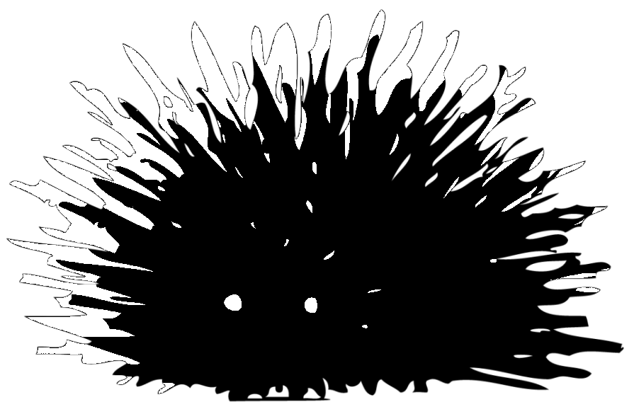

  
# Octocat-rs

| ⚠️ This library is still very much a WIP. Please do not attempt to use it for anything real yet. |
|-|

## About

A GitHub API library written in Rust.

## Documentation

Beginner's documentation can be found in the [book](https://github.com/octocat-rs/book) repository.
